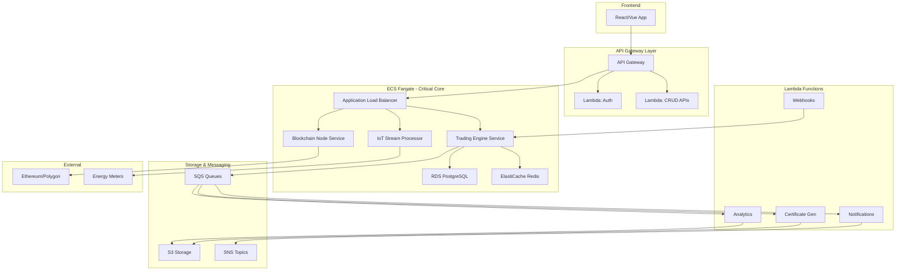

# Decision Matrix: ECS + Lambda Hybrid Architecture

## Executive Summary

For Energrid, we will implement a **hybrid architecture** where critical components requiring total control and high performance use **ECS Fargate**, while auxiliary operations and APIs use **Lambda + API Gateway**.

## Decision Matrix by Component

### 🚀 ECS Fargate - Total Control & High Performance

| Component | Justification | Characteristics | Performance Requirements |
|-----------|---------------|-----------------|-------------------------|
| **Blockchain Node** | Total control of Ethereum/Polygon node | - Persistent storage required - Version control - Advanced configurations | - 24/7 uptime - <100ms latency - >1000 TPS |
| **Smart Contract Interaction Layer** | Critical transactions with kWhToken, CELToken | - Connection pooling - Transaction batching - State management | - Atomic operations - Consistent state - Gas optimization |
| **Energy Trading Engine** | Core trading logic for EnergyTradeContract | - Complex algorithms - Real-time pricing - Multi-step workflows | - Sub-second execution - High concurrency - Memory intensive |
| **Real-time Energy Meter Integration** | IoT meter data streaming | - WebSocket connections - Stream processing - Persistent connections | - <50ms latency - High throughput - Continuous processing |

### ⚡ Lambda + API Gateway - Scalability & Cost-Effectiveness

| Component | Justification | Characteristics | Use Cases |
|-----------|---------------|-----------------|-----------|
| **User Authentication** | Simple stateless operations | - Cognito integration - JWT handling - Short-lived operations | Login, logout, token refresh |
| **Notification Service** | Event-driven notifications | - SQS/SNS triggers - Email/SMS sending - Parallel processing | Trade completion, alerts |
| **Data Analytics & Reporting** | Non-critical batch processing | - S3 data processing - CloudWatch metrics - Scheduled reports | Daily reports, usage analytics |
| **Certificate Generation** | CELToken metadata creation | - Template processing - PDF generation - File uploads to S3 | Certificate PDFs, compliance docs |
| **API Gateway Endpoints** | Simple CRUD operations | - Database queries - Simple validations - Caching | User profiles, trade history |
| **Webhook Handlers** | External integrations | - Third-party callbacks - Event processing - Data transformation | Payment callbacks, IoT webhooks |

## Decision Criteria

### Use ECS Fargate When:
- ✅ **Critical Performance**: <100ms response time required
- ✅ **Persistent State**: Connections, caches, in-memory data
- ✅ **Long-running Processes**: >15 minutes execution time
- ✅ **Granular Control**: Custom runtime, libraries, configurations
- ✅ **Resource Intensive**: >3GB RAM, >1 vCPU sustained
- ✅ **Atomic Operations**: Multi-step critical transactions

### Use Lambda + API Gateway When:
- ✅ **Stateless Operations**: No state dependencies
- ✅ **Execution <15 minutes**: Short, specific functions
- ✅ **Automatic Scalability**: Unpredictable traffic spikes
- ✅ **Cost-effectiveness**: Pay-per-execution model
- ✅ **Event-driven**: Triggered by SQS, S3, DynamoDB, etc.
- ✅ **Rapid Development**: Less infrastructure management

## Integration Architecture

## Cost Estimates (Monthly)

### ECS Fargate
| Service | vCPU | Memory | Cost/Month |
|---------|------|---------|------------|
| Trading Engine | 2 | 4GB | ~$85 |
| Blockchain Node | 1 | 2GB | ~$43 |
| IoT Processor | 1 | 2GB | ~$43 |
| **Total ECS** | | | **~$171** |

### Lambda + Supporting Services
| Service | Usage | Cost/Month |
|---------|-------|------------|
| Lambda (1M requests) | Various | ~$20 |
| API Gateway | 1M requests | ~$3.50 |
| RDS (db.t3.micro) | 24/7 | ~$25 |
| ElastiCache (cache.t3.micro) | 24/7 | ~$15 |
| **Total Lambda Stack** | | | **~$63.50** |

**Estimated Total: ~$234.50/month** (vs ~$400+ ECS only or Lambda-only limitations)

## Implementation Plan

### Phase 1: Core ECS Services (Weeks 1-2)
1. **Trading Engine**: Deploy on ECS with RDS/Redis
2. **Blockchain Node**: Configure Ethereum node on ECS
3. **Load Balancer**: ALB with health checks

### Phase 2: Lambda Functions (Week 3)
1. **Authentication**: Cognito + Lambda
2. **CRUD APIs**: DynamoDB + Lambda
3. **Notifications**: SQS + SNS integration

### Phase 3: Integration & Optimization (Week 4)
1. **API Gateway**: Route traffic between ECS/Lambda
2. **Monitoring**: CloudWatch dashboards
3. **Testing**: Load testing and optimization

## Security Considerations

### ECS Security
- VPC private subnets
- Restrictive security groups
- Granular IAM roles
- Secrets Manager integration

### Lambda Security
- VPC configuration for database access
- Environment variables encryption
- API Gateway throttling
- WAF protection

## Monitoring and Alerts

### ECS Metrics
- CPU/Memory utilization
- Task health status
- Application-specific metrics

### Lambda Metrics
- Invocation count/errors
- Duration/timeouts
- Cold start monitoring

Would you like me to proceed with implementing this hybrid architecture?
